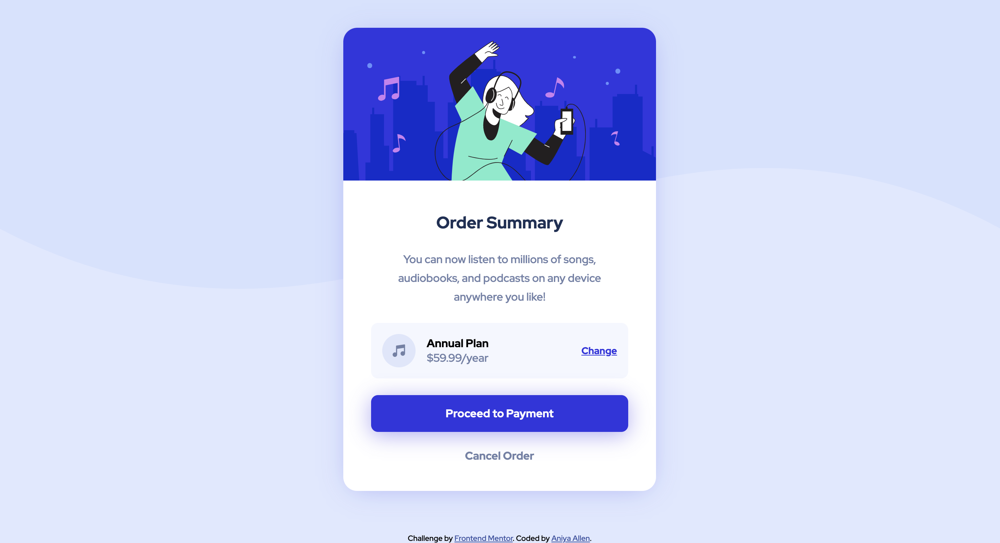

# Frontend Mentor - Order summary card solution

This is my solution to the [Order summary card challenge on Frontend Mentor](https://www.frontendmentor.io/challenges/order-summary-component-QlPmajDUj). Frontend Mentor challenges help you improve your coding skills by building realistic projects. 

## Table of contents

- [Overview](#overview)
  - [The challenge](#the-challenge)
  - [Screenshot](#screenshot)
  - [Links](#links)
- [My process](#my-process)
  - [Built with](#built-with)
  - [What I learned](#what-i-learned)
  - [Continued development](#continued-development)
  - [Useful resources](#useful-resources)
- [Author](#author)
- [Acknowledgments](#acknowledgments)

## Overview

### The challenge

The challenge was to build out the Order Summary Component and get it looking as close as the provided design as possible. This challenge was done without access to the design files and rather by estimating sizes of elements. However, the style guide provided by Frontend Mentor helped by providing colors, font-sizes, font-family, etc.

Users should be able to:
- See hover states for interactive elements

### Screenshot

### Links

- Solution URL: [Add solution URL here](https://github.com/amallen1/order-sum-component)
- Live Site URL: [Add live site URL here](https://flamboyant-boyd-21a3e8.netlify.app/)

## My process

### Built with

- Semantic HTML5 markup
- SCSS
- Flexbox
- Mobile-first workflow

### What I learned

This project was quite easy as I've become more experienced with HTML, and CSS. I rather used what I learned from previous projects in order to replicate the given design.

### Continued development

~~

### Useful resources

- Previous project code

## Author

- Frontend Mentor - [@yourusername](https://www.frontendmentor.io/profile/amallen1)
